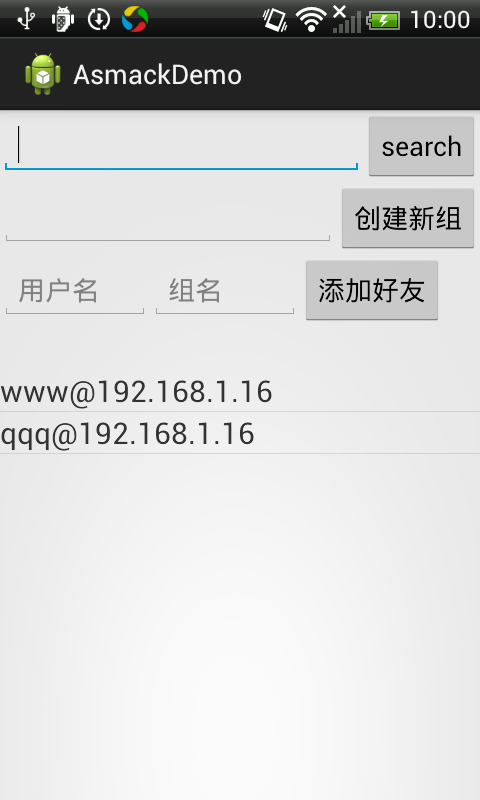

# AsmackDemo
Demo about asmack

asmack 0.8.10 source from http://asmack.freakempire.de/0.8.10/

More useful method at net.fengg.asmack.demo.util.CommonMethod

Compiled asmack.jar https://github.com/dotfeng/AsmackDemo/raw/master/asmack.jar

API include

